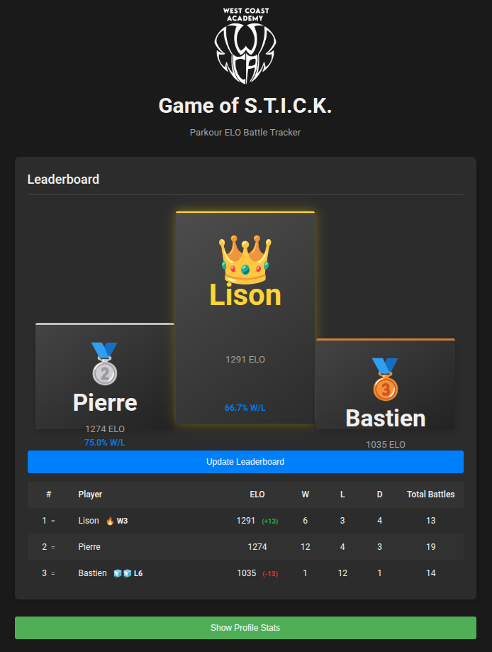

# 🎮 Game of STICK — ELO Tracker

> **Track player rankings, match history, and performance stats for Parkour "Stick" battles.**

**Created by Pierre Puchaud** • [puchaud.pierre@gmail.com](mailto:puchaud.pierre@gmail.com)



---

## 🤺 Challenge Rules

The **Game of STICK** is a parkour duel where players challenge each other with moves ending in a "stick" (clean landing).

### How a Challenge Works

```
🤺 Challenger → 🤝 Proposes a match → 🤔 Opponent accepts?
                                          │
                    ❌ No → 🔍 Find another opponent
                    ✅ Yes ↓
                    
📜 Propose a challenge (moves ending with a stick 🤸)
                    ↓
🤷 Both agree on the moves?
    ❌ No → Propose again
    ✅ Yes ↓
    
🚀 Challenger attempts → 🎯 Success?
                              │
    ┌─────────────────────────┴─────────────────────────┐
    ✅ Yes                                           ❌ No
    ↓                                                 ↓
👻 Opponent attempts                          👻 Opponent attempts
    ↓                                                 ↓
🎯 Success?                                    🎯 Success?
    │                                                 │
✅ Yes → 🤝 Accept draw?                      ✅ Yes → 🏆 Opponent Wins!
         ✅ → ⚖️ Draw                         ❌ No → 🔄 Both failed, retry!
         ❌ → 🔄 Retry
❌ No → 🏆 Challenger Wins!
```

### Summary

| Challenger | Opponent | Result |
|:----------:|:--------:|:------:|
| ✅ Success | ❌ Fail | 🏆 **Challenger Wins** |
| ❌ Fail | ✅ Success | 🏆 **Opponent Wins** |
| ✅ Success | ✅ Success | ⚖️ **Draw** (or retry) |
| ❌ Fail | ❌ Fail | 🔄 **Retry** |

> 📄 See [docs/challenge-chart-fr.md](docs/challenge-chart-fr.md) for the full flowchart diagram.

---

## ✨ Key Features

| Feature | Description |
|---------|-------------|
| **ELO Ratings** | Auto-calculated ratings with configurable K-factor |
| **Live Leaderboard** | Position changes (▲▼) and ELO diffs (+/-) |
| **ELO Evolution Chart** | 📈 Beautiful animated chart showing all players' rating progression |
| **Win/Loss Streaks** | 🔥 Win streaks, 🧊 Loss streaks with visual indicators |
| **Podium Display** | Top 3 players with medals 🥇🥈🥉 |
| **Combat Matrix** | Head-to-head stats visualized in a heatmap |
| **Player Profiles** | Detailed per-player stats and match history |
| **PDF Export** | 📄 Export full tournament stats as printable PDF |
| **📱 Instagram Stories** | Generate shareable 1080×1920 story images in 2 themes |
| **Multi-Window Sync** | Real-time sync between browser tabs |
| **File-Based Save** | Save games to local folders as CSV files |
| **🛡️ Crash Recovery** | Auto-backup protects against browser crashes and data loss |

---

## 🛡️ Crash Recovery & Backup

Never lose your game data again! The app automatically protects you from browser crashes and accidental tab closures.

### How It Works

1. **Auto-Backup**: When you record a match or add a player, a backup file is automatically saved to `saved_games/.temp/`.
2. **Crash Detection**: If something goes wrong (crash, power outage, accidental close), the backup file remains safe.
3. **Recovery**: Next time you load your game:
   - A prompt appears: `⚠️ Unsaved crash recovery file found. Do you want to restore it?`
   - Click **OK** to restore your lost progress.
4. **Auto-Cleanup**: When you manually **Save Game** or **Exit** (and confirm), the backup is deleted automatically.

> ⚠️ **Note:** The `.temp` folder is hidden from the game library list, but you can view it in your file explorer if needed.

---

## 🚀 Quick Start

### Prerequisites
- Node.js 18+ and npm

### Installation

```bash
# Clone the repository
git clone https://github.com/Ipuch/game-of-stick-elo-tracker.git

# Navigate to the app directory
cd game-of-stick-elo-tracker/src-game-of-stick-elo-tracker

# Install dependencies
npm install

# Start development server
npm run dev
```

Open `http://localhost:5173` in your browser.

### Running Tests

```bash
npm test          # Run tests once
npm run test:watch  # Watch mode
```

---

## 📖 Step-by-Step Tutorial

### 1️⃣ Create or Load a Game

| Action | How |
|--------|-----|
| **Try Example Game** | Click "EXAMPLE GAME" to explore with sample data |
| **Create New Game** | Enter a name and K-factor, click "Initialize System" |
| **Load Saved Games** | Click "📂 Load Saved Games" → Select your folder |

### 2️⃣ Add Players

1. Go to **ADD PLAYERS** tab
2. Enter player name
3. Click **Add Player**

### 3️⃣ Record Matches

1. Go to **ARENA** tab
2. Select **Player 1** and **Player 2** from autocomplete
3. Choose winner: **P1 Wins**, **P2 Wins**, or **Draw**
4. Click **Record Result**

### 4️⃣ Update the Leaderboard

- Click **UPDATE LEADERBOARD** to see:
  - Position changes (▲▼ arrows)
  - ELO differences (+30, -15)
  - Current streaks (🔥 W3, 🧊 L2)

### 5️⃣ View Stats & Export PDF

- Go to **STATS** tab to see:
  - 📈 ELO Evolution chart (all players over time)
  - Player profiles with match history
  - Click **📄 Export PDF Stats** for printable report
  - Click **📱 Export Instagram Stories** for shareable social media images

### 6️⃣ Share on Instagram

1. Go to **STATS** tab
2. Click **📱 Export Instagram Stories**
3. **6 images** are automatically downloaded:
   - 3 in **Neon Cyberpunk** style (dark, glowing, sci-fi)
   - 3 in **Cholet WCA** style (clean white, red accents)
4. Upload to Instagram Stories!

### 7️⃣ Save Your Game

1. Click **SAVE GAME** button
2. First time: Select a folder location
3. Data is saved as CSV files (`players.csv`, `matches.csv`)

### 8️⃣ Exit and Return

- Click **EXIT GAME** to return to the menu
- Your library folder stays selected for quick access

---

## 🔄 Multi-Window Sync

**Perfect for events!** Use two screens:
- **Screen 1**: Record matches (Arena view)
- **Screen 2**: Display leaderboard (Projector view)

### How It Works

1. Open the app in **two browser tabs/windows**
2. Load the **same game** in both
3. When you **Save** in one window, the other auto-updates
4. The display window shows:
   - Position changes since last save
   - ELO changes since last save
   - Updated streaks

> ⚡ Sync happens automatically via BroadcastChannel API — no server needed!

---

## 🛠️ Tech Stack

- **TypeScript** — Type-safe code
- **Vite** — Fast development and builds
- **Vitest** — Unit testing framework
- **File System Access API** — Local file persistence
- **BroadcastChannel API** — Cross-tab synchronization
- **ECharts** — Interactive chart visualizations
- **html2canvas** — Instagram story image generation
- **Pure CSS** — No framework dependencies

---

## 📁 Project Structure

```
src-game-of-stick-elo-tracker/
├── index.html          # Main HTML
├── index.tsx           # App entry point
├── index.css           # Styles (manga-inspired theme)
├── types/              # TypeScript interfaces
├── state/              # Global store
├── scoring/            # Scoring system (ELO) - extensible
│   ├── scoringTypes.ts # Interfaces for scoring systems
│   ├── eloScoring.ts   # ELO implementation
│   └── index.ts        # Exports and factory
├── renderers/          # UI rendering functions
│   ├── leaderboard.ts          # Leaderboard table
│   ├── podium.ts               # Top 3 display
│   ├── battleHistory.ts        # Match history list
│   ├── combatMatrix.ts         # Head-to-head heatmap
│   ├── profileStats.ts         # Player profile cards
│   ├── eloEvolutionChart.ts    # SVG ELO chart
│   ├── eloEvolutionChartEcharts.ts  # ECharts ELO chart
│   ├── aggregatedDashboard.ts  # Cross-game stats dashboard
│   ├── libraryRenderer.ts      # Game library list
│   ├── menuRenderer.ts         # Main menu UI
│   ├── opponentsRenderer.ts    # Remaining opponents display
│   └── rosterRenderer.ts       # Player roster
├── handlers/           # Event handlers
│   ├── matchHandlers.ts        # Match recording
│   ├── playerHandlers.ts       # Player management
│   ├── sessionHandlers.ts      # Game session logic
│   └── importExportHandlers.ts # Import/export actions
├── services/           # Background services
│   └── syncService.ts          # Cross-tab synchronization
├── ui/                 # UI components
│   ├── autocomplete.ts         # Player autocomplete
│   └── notificationSystem.ts   # Status bar notifications
├── utils/              # Utilities
│   ├── csvUtils.ts             # CSV parsing/export
│   ├── fileSystemPersistence.ts # File system storage
│   ├── localStoragePersistence.ts # LocalStorage fallback
│   ├── pdfExport.ts            # PDF generation
│   ├── instagramExport.ts      # Instagram story image generation
│   ├── aggregationUtils.ts     # Cross-game aggregation
│   ├── chartUtils.ts           # Chart helpers
│   ├── opponentTracker.ts      # Remaining opponents logic
│   └── ...                     # Other utilities
├── constants/          # App constants
└── tests/              # Unit tests
    └── scoring/        # Scoring system tests
```

---

## 📜 License

**Non-Commercial Use Only** — Commercial use requires written permission.

See [LICENSE.md](LICENSE.md) for full details.

© 2024 Pierre Puchaud. All rights reserved.

