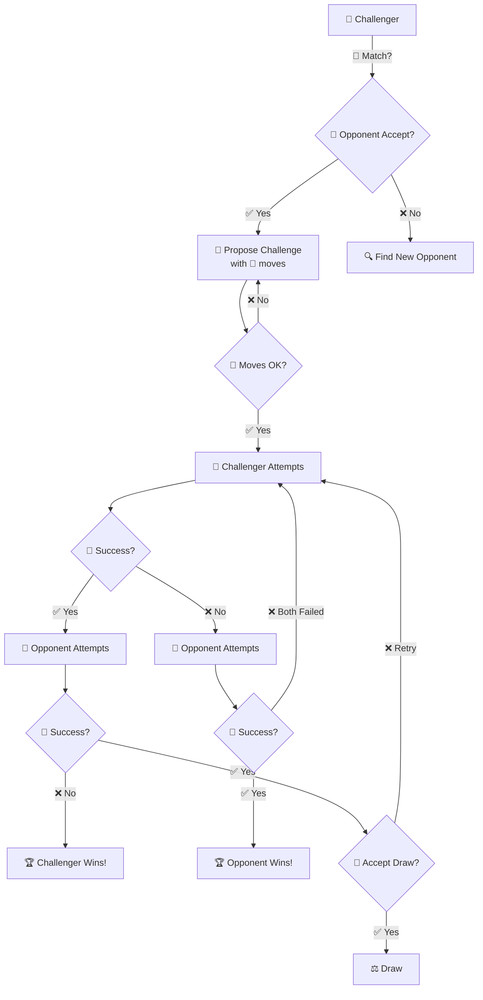

# The Challenge Chart

The goal of this document is to define the challenge chart for the game of stick elo tracker. 

## Challenge Flow

```mermaid

flowchart TD

A[🤺 Challenger] -->|🤝 Match?| B{🤔 Opponent Accept?}

B -- ✅ Yes --> C[📜 Propose Challenge\nwith 🤸 moves]

B -- ❌ No --> Z[🔍 Find New Opponent]

C --> D{🤷 Moves OK?}

D -- ❌ No --> C

D -- ✅ Yes --> E[🚀 Challenger Attempts]

E --> F{🎯 Success?}

F -- ✅ Yes --> G[👻 Opponent Attempts]

F -- ❌ No --> H[👻 Opponent Attempts]

G --> I{🎯 Success?}

H --> J{🎯 Success?}

I -- ❌ No --> L[🏆 Challenger Wins!]

J -- ✅ Yes --> M[🏆 Opponent Wins!]

J -->|❌ Both Failed| E

I -- ✅ Yes --> N{🤝 Accept Draw?}

N -- ✅ Yes --> K[⚖️ Draw]

N -->|❌ Retry| E

```
